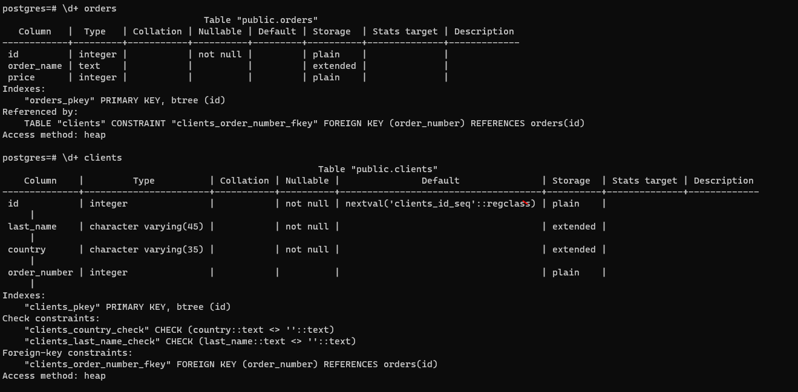
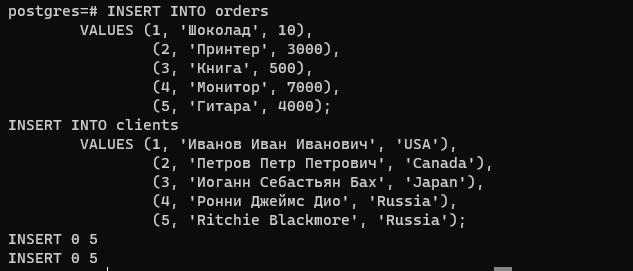

Задача 1

PS C:\\docker\\nettology1308\>docker pull postgres:12

PS C:\\docker\\nettology1308\> docker volume create vol2

PS C:\\docker\\nettology1308\> docker volume create vol1

PS C:\\docker\\nettology1308\> docker run \--rm \--name pg-docker -e
POSTGRES_PASSWORD=postgres -ti -p 5432:5432 -v
vol1:/var/lib/postgresql/data -v vol2:/var/lib/postgresql postgres:12

Задача 2

PS C:\\docker\\nettology1308\> docker exec -it f6b54a8aa563 bash

root\@f6b54a8aa563:/\# psql -U postgres

CREATE DATABASE test_db

CREATE ROLE \"test-admin-user\" SUPERUSER NOCREATEDB NOCREATEROLE
NOINHERIT LOGIN;

postgres=\# CREATE TABLE orders

(

id integer,

order_name text, price integer,

PRIMARY KEY (id)

);

postgres=\# CREATE TABLE clients (

id serial PRIMARY KEY,

last_name varchar(45) NOT NULL CHECK (last_name \<\> \'\'),

country varchar(35) NOT NULL CHECK (country \<\> \'\'),

order_number integer REFERENCES orders

);

postgres=\# CREATE ROLE \"test-simple-user\" NOSUPERUSER NOCREATEDB
NOCREATEROLE NOINHERIT LOGIN;

postgres=\# GRANT SELECT ON TABLE public.clients TO
\"test-simple-user\";

GRANT INSERT ON TABLE public.clients TO \"test-simple-user\";

GRANT UPDATE ON TABLE public.clients TO \"test-simple-user\";

GRANT DELETE ON TABLE public.clients TO \"test-simple-user\";

GRANT SELECT ON TABLE public.orders TO \"test-simple-user\";

GRANT INSERT ON TABLE public.orders TO \"test-simple-user\";

GRANT UPDATE ON TABLE public.orders TO \"test-simple-user\";

GRANT DELETE ON TABLE public.orders TO \"test-simple-user\";

List of databases

Name \| Owner \| Encoding \| Collate \| Ctype \| Access privileges

\-\-\-\-\-\-\-\-\-\--+\-\-\-\-\-\-\-\-\--+\-\-\-\-\-\-\-\-\--+\-\-\-\-\-\-\-\-\-\-\--+\-\-\-\-\-\-\-\-\-\-\--+\-\-\-\-\-\-\-\-\-\-\-\-\-\-\-\-\-\-\-\-\-\--

postgres \| postgres \| UTF8 \| en_US.utf8 \| en_US.utf8 \|

template0 \| postgres \| UTF8 \| en_US.utf8 \| en_US.utf8 \| =c/postgres
+

\| \| \| \| \| postgres=CTc/postgres

template1 \| postgres \| UTF8 \| en_US.utf8 \| en_US.utf8 \| =c/postgres
+

\| \| \| \| \| postgres=CTc/postgres

test_db \| postgres \| UTF8 \| en_US.utf8 \| en_US.utf8 \|

(4 rows)

{width="6.114583333333333in"
height="4.40625in"}

{width="5.25in"
height="3.5625in"}

{width="6.496527777777778in"
height="3.196527777777778in"}

Задача 3

{width="6.496527777777778in"
height="2.78125in"}
{width="4.885416666666667in"
height="2.2291666666666665in"}

Задача 4.

{width="5.75in"
height="1.3020833333333333in"}

{width="6.489583333333333in"
height="1.6458333333333333in"}

Задача 5

{width="6.496527777777778in"
height="1.676388888888889in"}

Запрос показывает время на исполнение запроса и другую служебную
информацию. Эти данные можно использовать при оптимизации.

Задача 6.

PS C:\\docker\\nettology1308\> docker exec -t pg-docker pg_dump -U
postgres test_db -f /var/lib/postgresql/data/dump.sql

PS C:\\docker\\nettology1308\> docker exec -i pg-docker2 psql -U
postgres -d test_db -f /var/lib/postgresql/data/dump.sql

Проверяем, что восстановление успешно

postgres-\# \\l

List of databases

Name \| Owner \| Encoding \| Collate \| Ctype \| Access privileges

\-\-\-\-\-\-\-\-\-\--+\-\-\-\-\-\-\-\-\--+\-\-\-\-\-\-\-\-\--+\-\-\-\-\-\-\-\-\-\-\--+\-\-\-\-\-\-\-\-\-\-\--+\-\-\-\-\-\-\-\-\-\-\-\-\-\-\-\-\-\-\-\-\-\--

postgres \| postgres \| UTF8 \| en_US.utf8 \| en_US.utf8 \|

template0 \| postgres \| UTF8 \| en_US.utf8 \| en_US.utf8 \| =c/postgres
+

\| \| \| \| \| postgres=CTc/postgres

template1 \| postgres \| UTF8 \| en_US.utf8 \| en_US.utf8 \| =c/postgres
+

\| \| \| \| \| postgres=CTc/postgres

test_db \| postgres \| UTF8 \| en_US.utf8 \| en_US.utf8 \|
